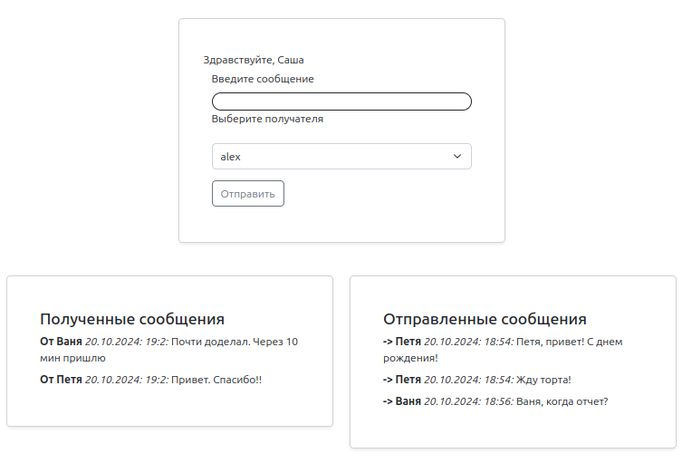

### Cервис для обмена мгновенными сообщениями между пользователями в реальном времени.



#### Используемые технологии:
- Backend: FastApi
- Frontend: React
- Darabase: Postgres
- Celery
- Redis
- отправка сообщений пользователям: Aiogram

Реализована авторизация пользователей посредством JWT-токенов с передачей через Bearer-заголовки<br>

---

#### Запуск локально:

1. Клонировать проект:
```commandline
git clone git@github.com:al-ov73/users_chat.git && cd users_chat
```
2. Создать и заполнить файл с переменными окружения _.env-non-dev_  (либо использовать внесенные в _.env-non-dev_example_)</br></br>
3. Собрать образ и запустить его:
```commandline
docker compose build
docker compose up
```